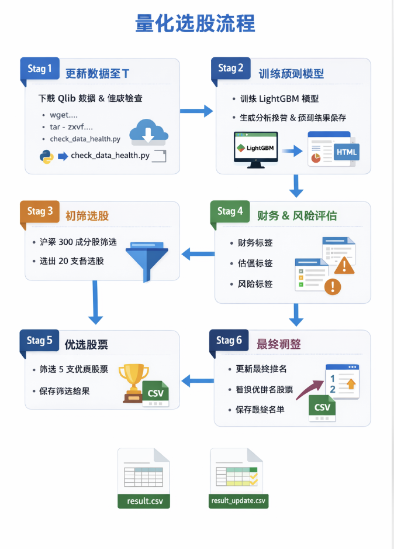

# Qlib + RDAgent 使用指南（面向初学者）

**流程图：Stage1→Stage6 概览**



本文档面向小白用户，覆盖：环境搭建（使用镜像 `zhuhai123/qlib-rdagent:v1`）、Qlib 数据获取、以及如何使用仓库内的 `run_alpha158_practice` 脚本顺序执行 stage1→stage6（并说明每个步骤做了什么与输出结果存放位置）。

---

## 1. 前提条件
- 本机已安装 Docker（macOS 推荐安装 Docker Desktop）。
- 本仓库已克隆到本地，工作目录为仓库根目录（示例：`/Users/apple/gitee/qlib`）。

---

## 2. 使用的镜像（快速开始）

```
docker pull zhuhai123/local_qlib:latest
docker pull zhuhai123/qlib-rdagen:v1
```

## 3. Qlib 数据下载（保持原方法）
项目中使用的 qlib 数据可参考并下载：

- 数据发布页面（仓库保留的方法）：
- https://github.com/chenditc/investment_data/releases

下载后将数据解压到主机的 `~/.qlib/qlib_data` 下（容器中映射为 `/root/.qlib/qlib_data`），或者按项目中已有的路径约定放置。确保 `calendars/day.txt` 等文件存在，qlib 初始化能正常完成。

示例（主机上）：

```bash
# 下载并解压到本地，然后确保路径为 $HOME/.qlib/qlib_data
mkdir -p ~/.qlib/qlib_data/cn_data
# 将 release 中的 qlib 数据包解压到 $HOME/.qlib/qlib_data
tar -zxvf qlib_bin.tar.gz -C ~/.qlib/qlib_data/cn_data --strip-components=1
```

---

## 4. run_alpha158_practice 脚本总览
仓库内封装了 `run_alpha158_practice` 启动脚本用于按 stage 顺序运行实验（常用环境变量驱动走样本历史和折数）：

主要环境变量示例：
- `WALK_FORWARD_HISTORY_YEARS`：回溯多少年历史（例如 `2`、`10`）。
- `WALK_FORWARD_START_DATE`：回测起始日期（如 `2024-01-01`）。
- `WALK_FORWARD_SEGMENT_YEARS`：每个 fold 的年长（例如 `1` 表示每个 fold 覆盖 1 年）。

调用格式（仓库根目录）：

```bash
# 全流程 stage1->stage6 示例（按你的需求替换 envs 和 experiment 名称）
WALK_FORWARD_HISTORY_YEARS=2 \
WALK_FORWARD_START_DATE=2024-01-01 \
WALK_FORWARD_SEGMENT_YEARS=1 \
bash run_alpha158_practice my_experiment_name stage=1 end_stage=6
```

说明：`stage` 与 `end_stage` 控制要从哪个阶段开始到哪个阶段结束（包含两端）。例如：仅跑 stage2：`stage=2 end_stage=2`。

---

## 5. Stage1 → Stage6：每个阶段做了什么（面向初学者的简要解释）

以下说明是对仓库中 pipeline 的高层抽象（与工程实现对应）：

- **Stage1 — 数据准备 / 特征工程**
  - 做什么：从 qlib 数据源读取原始行情、因子或其他信息，做必要的清洗与特征计算，生成训练/验证所需的数据集（例如滚动窗口、标签构建等）。
  - 常见输出：用于训练/预测的 feature files、时间序列面板文件，通常保存到 `DATA/` 或 `rdagent_workspace/` 下的中间目录。

- **Stage2 — 模型训练与预测（生成信号）**
  - 做什么：用 Stage1 生成的数据训练因子模型（常见：LightGBM、XGBoost 等），对验证/回测时间段做预测，输出每个交易日/标的的预测分数（signal）。
  - 常见输出：`model_predict/` 下的信号文件、`walk_forward_summary.csv`（各 fold 的 IC/收益指标）、以及用于后续回测的 `signal.csv` 或 `trade_signal.csv`。

- **Stage3 — 信号后处理 / 过滤**
  - 做什么：对原始预测信号做一系列规则过滤（例如剔除流动性差、异常值、行业中性化、与已有规则合并等），以得到更可交易的信号。你之前的实验中，就是这里会把信号变得非常稀疏。
  - 常见输出：筛选后的信号文件（可能命名为 `stage3_signal.csv` 之类，视实现而定）。

- **Stage4 — 组合构建 / 持仓权重计算**
  - 做什么：把信号转换为实际下单的组合权重（Top-k 策略、等权、风险平价等），包含再平衡窗口（如每周/每日）、个股权重分配与替换逻辑（例如 top-5，每周替换掉排名掉出 50% 的）。
  - 常见输出：组合权重时间序列、下单清单（orders）、以及用于回测的持仓快照。

- **Stage5 — 回测引擎 / 交易模拟**
  - 做什么：基于组合权重与历史价格、手续费规则，模拟真实交易以得出资金曲线、成交明细、换手率等风险与性能指标。
  - 常见输出：`report_of_backtest.txt`、交易记录 CSV、回测时间序列图表文件等，通常放在 `DATA/analysis_outputs/<experiment>/full_backtest/`。

- **Stage6 — 分析与汇总（Walk-forward 汇总）**
  - 做什么：对多个 fold 的回测结果做聚合统计（walk-forward summary），计算 fold 级别与总体的 IC、ICIR、年化收益、最大回撤、Sharpe、信息比率等指标，并生成最终汇总表。
  - 常见输出：`model_predict/walk_forward_summary.csv`、`final_result/result_update.csv` 等。

> 注：以上阶段在代码中通常以脚本/函数划分，你可以通过调整 `stage`、`end_stage` 环境变量只执行所需的阶段（便于开发与调试）。

---

## 6. 运行示例（常用场景）

- 仅跑 Stage2（快速检查、2-fold 示例）

```bash
WALK_FORWARD_HISTORY_YEARS=2 \
WALK_FORWARD_START_DATE=2024-01-01 \
WALK_FORWARD_SEGMENT_YEARS=1 \
bash run_alpha158_practice stage2_2fold_check stage=2 end_stage=2
```

- 跑完整 Stage1→Stage6（短历史回测）

```bash
WALK_FORWARD_HISTORY_YEARS=2 \
WALK_FORWARD_START_DATE=2024-01-01 \
WALK_FORWARD_SEGMENT_YEARS=1 \
bash run_alpha158_practice stage1_to_stage6_fullcheck_2026 stage=1 end_stage=6
```

- 跑完整 Stage1→Stage6（长历史回测，例如 10 年）

```bash
WALK_FORWARD_HISTORY_YEARS=10 \
WALK_FORWARD_START_DATE=2008-01-01 \
WALK_FORWARD_SEGMENT_YEARS=1 \
bash run_alpha158_practice stage1_to_stage6_fullhistory_2008_2018 stage=1 end_stage=6
```

每个命令会在 `DATA/analysis_outputs/<experiment_name>/` 下产出结果目录（`<experiment_name>` 对应你传入的第一个脚本参数）。

---

## 7. 常见输出文件与含义（在 `DATA/analysis_outputs/<experiment>/`）

- `model_predict/walk_forward_summary.csv`：每个 fold 的 IC、年化收益、最大回撤、Sharpe 等聚合统计，用于评估模型在不同时间段的一致性。
- `report_of_backtest.txt`：回测的文本报告，包含收益率曲线、回测配置与主要指标摘要。
- `final_result/result_update.csv`：最终结果汇总表，含某些指标与元信息（实验级别的汇总）。
- `full_backtest/signal.csv`：回测中使用的时间序列信号（按日期/标的），便于审计与逐笔复现。
- `full_backtest/trade_signal.csv` 或 `trade_signal.csv`：实际触发下单的信号（交易日层面），用于对账与持仓历史复现。

示例路径：

- [DATA/analysis_outputs/<experiment>/model_predict/walk_forward_summary.csv](DATA/analysis_outputs/your_experiment/model_predict/walk_forward_summary.csv)

（注意：将 `your_experiment` 替换为实际实验名称）

---

## 8. 关于 Stage2-only 的特殊配置（你之前的改动示例）
你之前希望做的变体包括：

- 使用 Stage2 的原始信号（不经过 Stage3~Stage6 的稀疏过滤）；
- 价格上限过滤：剔除交易日收盘价 > 50 的标的（`price_cap=50`）；
- 每周重平衡，Top-5 策略；若排名掉出前 50%，则用当前得分最高的股票补位（dropout 替换）。

实现要点：在 `run_stage2_walk_forward.py` 中：

- 读取 Stage2 生成的 `signal.csv`（原始分数）；
- 通过 qlib 的 `D.features` 查询每个交易日的 `$close`，剔除收盘价大于阈值的标的；
- 将过滤后的信号按每周重新取 Top-5 并生成 `full_backtest/signal.csv` 与 `trade_signal.csv`。

运行示例（2-fold 快检）：

```bash
WALK_FORWARD_HISTORY_YEARS=2 \
WALK_FORWARD_START_DATE=2024-01-01 \
WALK_FORWARD_SEGMENT_YEARS=1 \
bash run_alpha158_practice stage2_2fold_check_20260408 stage=2 end_stage=2
```

运行完成后，查看 `DATA/analysis_outputs/stage2_2fold_check_20260408/` 下的 `full_backtest/` 与 `model_predict/` 子目录。

---

## 9. 故障排查小贴士

- 容器中运行报错找不到 qlib 数据：确认主机上 `~/.qlib/qlib_data` 已存在并包含 `calendars/day.txt`，容器启动时挂载了 `-v "$HOME/.qlib:/root/.qlib"`。
- replay/import 下游 stage 脚本失败：确保仓库根目录在 Python 路径中（脚本在运行时会尝试把仓库根加入 `sys.path`）。
- 回测结果极度稀疏（交易日/信号很少）：检查 Stage3~Stage6 的过滤规则，可临时使用 Stage2 原始信号进行对照检验。

---

## 10. 下步建议（如果你想继续）

- 使用rd-agent智能体挖掘新因子
- 扩充当前数据特征维度，增加基本面、财务等数据的数据处理pipeline
- 优化交易策略
- 用更优的模型（限于算力，当前只使用了XGBoost、LightGBM模型）

---

## 附：在 `rd-agent` 环境下运行 `fin_factor`（以及 API key 管理）

下面是专门针对 `rdagent fin_factor` 工作流在 `zhuhai123/qlib-rdagent:v1` 环境下的使用说明与安全建议（包括如何安全传入 API key）：

- 运行环境：同前面所述，建议使用镜像 `zhuhai123/qlib-rdagent:v1`，并挂载代码仓库与 qlib 数据目录。

- 运行前准备（主机或 CI 中）：
  1. 不要把真实 API key 写入仓库中的文件（例如 `.env`）。仓库中应只保留示例或占位符。我们已将仓库中的 `.env` 中 `OPENAI_API_KEY` 替换为占位符 `replace_with_your_api_key`。
  2. 在本地 shell 或 CI 环境中把 API key 赋值给环境变量，例如：

```bash
export OPENAI_API_KEY="your_real_api_key_here"
```

  3. 可选（本地调试无外部 LLM）：设置 `FORCE_LOCAL_STUB=1`，`rdagent` 会使用内置的 deterministic stub，便于调试而不访问远程模型。

- 在容器中运行 `fin_factor` 的示例（推荐，安全地传入 API key）：

```bash
export OPENAI_API_KEY="your_real_api_key_here"
docker run --rm -it \
  -e OPENAI_API_KEY \
  -e RDAGENT_MAX_ROUNDS=5 \
  -v "$PWD:/work" \
  -v "$HOME/.qlib:/root/.qlib" \
  -w /work \
  zhuhai123/qlib-rdagent:v1 \
  bash -lc "python scripts/run_fin_factor_with_cap.py"
```

说明：
- `-e OPENAI_API_KEY` 会把本地环境变量值安全传入容器，避免在镜像或代码中写明密钥。
- `RDAGENT_MAX_ROUNDS` 控制因子挖掘轮次（脚本中默认上限为 20，示例使用 5 轮）。
- 如果你倾向使用容器启动脚本的入口参数，也可以通过仓库的 `docker-entrypoint.sh` 支持 `--fin_factor` 标志（容器入口会调用 `scripts/run_fin_factor_with_cap.py`）。

- 在不希望或无法使用真实 LLM 服务时的两种调试方式：
  1. 在运行前设置 `FORCE_LOCAL_STUB=1`：脚本会用内置 stub 替代远程调用（见 `scripts/run_fin_factor_with_cap.py`）。
  2. 设置 `OPENAI_API_KEY` 为空但配合其他本地模型部署（超出本指南范围）。

- 不要把 API key 提交到代码仓库或日志文件中：
  - 请从仓库中删除任何包含密钥的历史提交（如果之前已提交敏感信息，请用 git-filter-repo 或 BFG 清理历史，并在凭证泄露后及时在 provider 侧撤销旧 key）。
  - 在本仓库我们已将 `patch_and_run.py` 中的硬编码默认 key 移除，改为从环境变量读取（请在运行时确保 `OPENAI_API_KEY` 已设置）。

